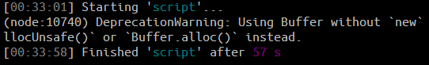
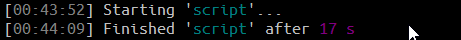
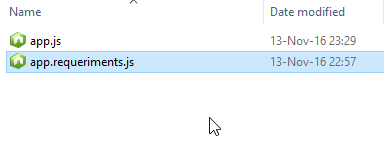

# asunder.js
A transform to build javascript files in the browser extending all dependencies in other file.

[](https://www.npmjs.com/package/asunder.js)
[](https://www.npmjs.com/package/asunder.js)
[](https://www.npmjs.com/package/asunder.js)

> Inspired on browserify but with all style of Gulp.

```javascript
const gulp = require("gulp")
const asunder = require("asunder.js").asunder

gulp.task("script", () =>
  gulp.src("src/scripts/**/*.js")
  .pipe(asunder({
    modules: [
      "react",
      "react-render",
      "debug",
      "lodash",
      "jquery"
    ],
  }))
  .pipe(gulp.dest("www"))
)

// Output files
// www/app.js
// www/app.requeriments.js
```


## What up? In the behaviour.
### OLD


### NOW



